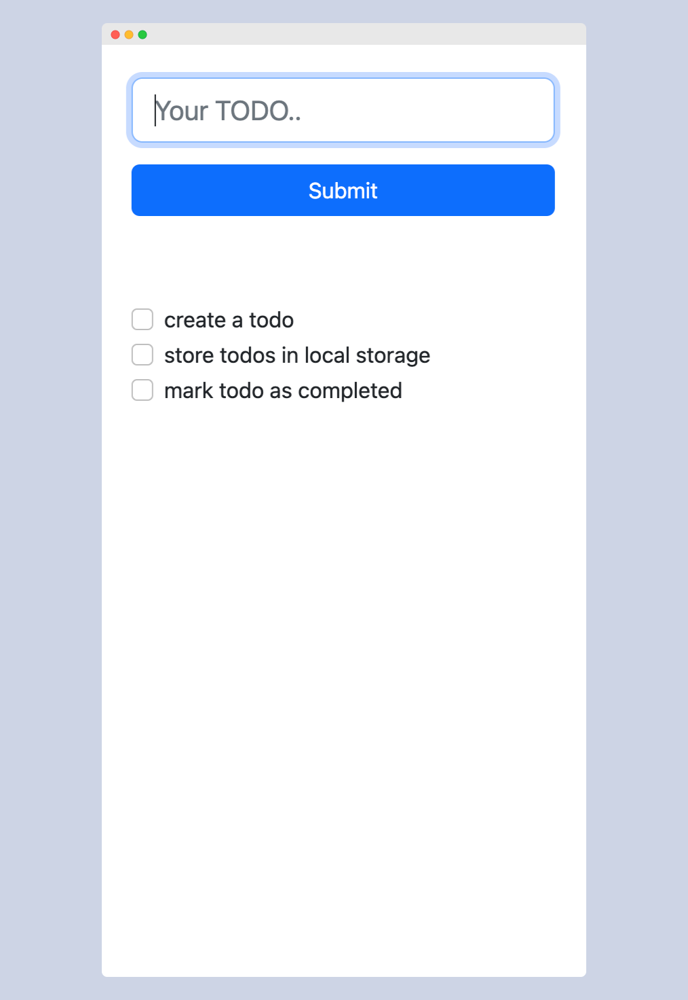

# TODO app using vanilla JavaScript

Building a TODO app is a very basic but thorough way to understand concepts of a software tool.

We will build a TODO app using [`JavaScript`](https://developer.mozilla.org/en-US/docs/Web/JavaScript) for logic and [`Bootstrap`](https://getbootstrap.com/) for styling in this tutorial.

<p align="center">
    
</p>

## We will follow the following steps:

### Building the `User Interface (UI)` with `Bootstrap`

1. Start with [`Bootstraps Starter Template`](https://getbootstrap.com/docs/5.2/getting-started/introduction/#quick-start)

1. Create a `form` for user to enter the TODO item.
1. Create an unordered list to `hold all todos`.
1. Create `list element` with checkbox for a todo item.
1. Make UI `responsive` using Bootstrap's grid system

### Handling `funtionality` with `JavaScript`

1. Define structure of our data - way to represent all TODOs in a [`JSON (JavaScript Object Notation)`](https://developer.mozilla.org/en-US/docs/Learn/JavaScript/Objects/JSON) format.
1. `renderTodos` function to display TODOs in the UI.
1. `renderTodo` helper function to render an individual TODO.
1. `addTodo` function to add a TODO
1. Setup an Event Listener for `submitting` the todo from the UI.
1. `completeTodo` function to mark a TODO as completed

## Building UI

##### Copy bootstrap's [starter template](https://getbootstrap.com/docs/5.0/getting-started/introduction/#starter-template) and add custom script tags

```html
<!DOCTYPE html>
<html lang="en">
  <head>
    <!-- Required meta tags -->
    <meta charset="utf-8" />
    <meta name="viewport" content="width=device-width, initial-scale=1" />

    <!-- Bootstrap CSS -->
    <link
      href="https://cdn.jsdelivr.net/npm/bootstrap@5.0.2/dist/css/bootstrap.min.css"
      rel="stylesheet"
      integrity="sha384-EVSTQN3/azprG1Anm3QDgpJLIm9Nao0Yz1ztcQTwFspd3yD65VohhpuuCOmLASjC"
      crossorigin="anonymous"
    />

    <title>TODO App</title>
  </head>
  <body>
    <!-- CONTENT -->
    <div></div>

    <!-- custom JS -->
    <script src="./script.js"></script>

    <!-- Bootstrap JS -->
    <script
      src="https://cdn.jsdelivr.net/npm/bootstrap@5.0.2/dist/js/bootstrap.bundle.min.js"
      integrity="sha384-MrcW6ZMFYlzcLA8Nl+NtUVF0sA7MsXsP1UyJoMp4YLEuNSfAP+JcXn/tWtIaxVXM"
      crossorigin="anonymous"
    ></script>
  </body>
</html>
```

##### Create a [form](https://getbootstrap.com/docs/5.0/forms/form-control/#sizing) for user to enter the TODO item

- Give unique `id` to `text field` and `form` to refer them in our JavaScript later.

```html
<form id="todo-form">
  <!-- input field -->
  <input
    id="todo-text"
    class="form-control form-control-lg"
    type="text"
    placeholder="Your TODO"
    required
  />
  <!-- submit button -->
  <input type="submit" class="btn btn-primary my-3 w-100" />
</form>
```

##### Create an unordered list to hold all todos

```html
<ul id="todo-list" class="list-unstyled"></ul>
```

##### Create list element with [checkbox](https://getbootstrap.com/docs/5.0/forms/checks-radios/#checks) for a todo item

```html
<li>
  <div class="form-check">
    <input class="form-check-input" type="checkbox" />
    <label class="form-check-label" for="flexCheckDefault"> TODO Text </label>
  </div>
</li>
```

##### Make UI responsive using Bootstrap's [grid system](https://getbootstrap.com/docs/5.0/layout/grid/#row-columns)

```html
<div class="container">
  <div class="row row-cols-1 row-cols-sm-1 row-cols-md-2">
    <div class="col">
      <!-- todo form goes here -->
    </div>
    <div class="col">
      <!-- todo list goes here -->
    </div>
  </div>
</div>
```

## Handle functionality using JavaScript

##### Lets start by creating an [array of objects](https://www.freecodecamp.org/news/javascript-array-of-objects-tutorial-how-to-create-update-and-loop-through-objects-using-js-array-methods/) for our `todos`.

```js
var todos = [
  {
    id: 0,
    text: "subscribe to KJSCE codecell",
    complete: false,
  },
  {
    id: 1,
    text: "Star https://github.com/pettiboy/react-ui-scrollspy on GitHub",
    complete: false,
  },
];
```

##### Select all required elements from the `DOM`

```js
const list = document.getElementById("todo-list");
const form = document.getElementById("todo-form");
const todoText = document.getElementById("todo-text");
```

##### Lets try to render these `todos` to the DOM from our `JS`

```js
/*
loops over each todo in todos and if the task is not completed yet
calls the renderTodo function to render it to the DOM
*/
function renderTodos() {
  emptyTodos();
  todos.forEach((todo) => {
    if (todo.complete === false) {
      renderTodo(todo);
    }
  });
}

/*
takes a todo object as input and appends the innerHTML 
of the unordered list with that todo
*/
function renderTodo(todo) {
  list.innerHTML += `
        <li>
          <div class="form-check">
            <input onclick="completeTodo(${todo.id});" class="form-check-input" type="checkbox" />
            <label class="form-check-label" for="flexCheckDefault">
              ${todo.text}
            </label>
          </div>
        </li>
      `;
}
```

##### Lets write a function that given a `todo` adds it to our array of objects called `todos`.

```js
function addTodo(todo) {
  todos.push({
    id: todo.id,
    text: todo.text,
    complete: todo.complete,
  });

  // render that todo to the DOM
  renderTodo(todo);
}
```

##### Setup an `Event Listener` for submitting the todo

```js
// listen for form to be submitted
form.addEventListener("submit", (e) => {
  e.preventDefault();

  addTodo({
    id: todos.length + 1,
    text: todoText.value,
    complete: false,
  });

  // reset value of input field
  todoText.value = "";
});
```

##### Lets write a function to mark a `todo` as `completed`

```js
function completeTodo(removeId) {
  // Find index of specific object using findIndex method.
  todoIndex = todos.findIndex((todo) => todo.id == removeId);

  // Update object's name property.
  todos[todoIndex].complete = true;

  // Just to wait for a sec before re rendering
  setTimeout(function () {
    saveTodosInMemory();
    renderTodos();
  }, 1000);
}
```

##### Store the todos in `localStorage`

```js
// on page load - the following functions will run
todos = JSON.parse(localStorage.getItem("todosInMemory")) || [];
renderTodos();
```

That's it! We have successfully built a TODO app using Vanilla JavaScript.
